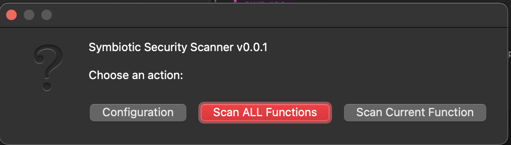
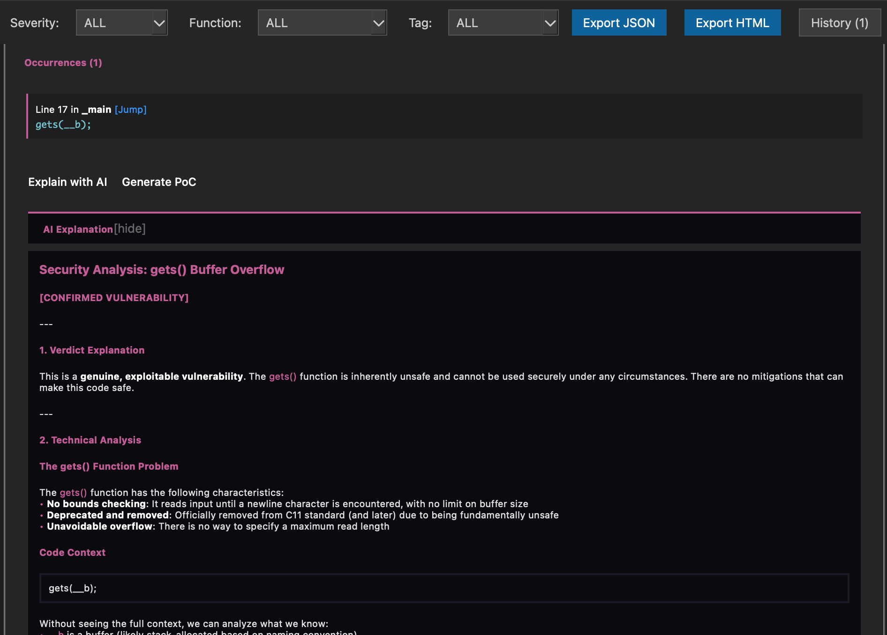

# IDA Symbiotic

<p align="center">
  
  
</p>

<p align="center">
  <b>Automated vulnerability detection in IDA Pro using SAST rules on decompiled code</b>
</p>

---

<p align="center">
  
</p>

---

## What is IDA Symbiotic?

IDA Symbiotic bridges the gap between **binary reverse engineering** and **static code analysis**. Instead of manually hunting for vulnerabilities in decompiled code, this plugin:

1. **Extracts pseudocode** from IDA's Hex-Rays decompiler
2. **Runs SAST rules** via [opengrep](https://github.com/opengrep/opengrep) on the C-like output
3. **Displays results** in an interactive UI directly inside IDA
4. **Provides AI explanations** (optional) for each finding

Perfect for **vulnerability research**, **CTF challenges**, and **security audits**.

---

## Installation

### 1. Copy the plugin folder

```bash
# macOS
cp -r symbiotic /Applications/IDA*/Contents/MacOS/plugins/

# Windows
xcopy symbiotic %IDADIR%\plugins\symbiotic\ /E /I

# Linux
cp -r symbiotic ~/.idapro/plugins/
```

### 2. Install opengrep

Download the **opengrep** binary from the official releases:

**https://github.com/opengrep/opengrep/releases**

Rename the binary to `opengrep-core` and place it in the IDA **plugins folder** (same location as the plugin):

```bash
# macOS
mv opengrep /Applications/IDA*/Contents/MacOS/plugins/opengrep-core

# Windows
move opengrep.exe %IDADIR%\plugins\opengrep-core.exe

# Linux
mv opengrep ~/.idapro/plugins/opengrep-core
```

> **Note**: The plugin expects the binary at `plugins/opengrep-core` by default. You can change this path in the plugin settings.

### 3. Configure AI (Optional)

See the [AI Integration](#-ai-integration) section below.

---

## Usage

| Shortcut | Action |
|----------|--------|
| `Ctrl+Shift+S` | Scan **current function** |
| `Ctrl+Shift+L` | Scan **ALL functions** |
| `Ctrl+Shift+A` | **Ask AI** about selected finding |

<p align="center">
  
</p>

---

## Detection Rules

IDA Symbiotic uses **YAML-based rules** powered by [opengrep](https://github.com/opengrep/opengrep) (a semgrep fork). Rules are defined in `code-rules.yaml`.

### Adding Custom Rules

**Why add custom rules?**
- Target **specific vulnerability patterns** for your audit
- Detect **proprietary API misuse** in embedded systems
- Create rules for **CTF-specific patterns**
- Hunt for **known CVE patterns** in binaries

**How to add a rule:**

Edit `code-rules.yaml` and add your pattern:

```yaml
rules:
  # Example: Detect dangerous gets() usage
  - id: BUFFER_OVERFLOW_GETS
    languages: [c]
    message: "Buffer overflow: gets() has no bounds checking"
    pattern: gets($BUF)
    severity: CRITICAL

  # Example: Detect potential integer overflow
  - id: INTEGER_OVERFLOW
    languages: [c]
    message: "Potential integer overflow in malloc size calculation"
    pattern: malloc($X * $Y)
    severity: WARNING

  # Example: Detect hardcoded credentials
  - id: HARDCODED_PASSWORD
    languages: [c]
    message: "Hardcoded password detected"
    pattern-regex: '(password|passwd|pwd)\s*=\s*"[^"]+"'
    severity: HIGH
```

**Pattern syntax reference:** See [opengrep/semgrep documentation](https://semgrep.dev/docs/writing-rules/pattern-syntax/)

**See the full rules file:** [`code-rules.yaml`](code-rules.yaml)

---

## AI Integration

IDA Symbiotic can use **LLM APIs** to provide detailed explanations of detected vulnerabilities and suggest exploitation paths.

### Quick Setup

1. **Copy the example configuration:**
   ```bash
   cp .env.example .env
   ```

2. **Edit `.env`** with your API credentials (see below)

3. **Use `Ctrl+Shift+A`** on any finding to get AI analysis

### Supported Providers

| Provider | Documentation | How to get API Key |
|----------|---------------|-------------------|
| **OpenAI** | [platform.openai.com](https://platform.openai.com/docs) | [Get API Key](https://platform.openai.com/api-keys) |
| **Anthropic (Claude)** | [docs.anthropic.com](https://docs.anthropic.com/) | [Get API Key](https://console.anthropic.com/settings/keys) |
| **Google Gemini** | [ai.google.dev](https://ai.google.dev/docs) | Requires OpenAI-compatible proxy |
| **Local Models** | Via [Ollama](https://ollama.ai/), [LM Studio](https://lmstudio.ai/) | Use OpenAI-compatible endpoint |

### Configuration Example

```bash
# .env file
AI_PROVIDER=openai
AI_API_KEY=sk-your-api-key-here
AI_MODEL=gpt-5.2
AI_BASE_URL=https://api.openai.com/v1  # Optional, for custom endpoints
```

<p align="center">
  
</p>

### AI Response Example

<p align="center">
  
</p>

---

## Features

- **Automatic Vulnerability Detection** — Scans decompiled functions for dangerous patterns
- **YAML-based Rules** — Easy to customize and extend with your own patterns
- **Interactive UI** — Filter by severity, function name, add custom tags
- **AI Analysis** — Get detailed explanations via LLM integration
- **Persistent State** — Tags and notes survive between IDA sessions
- **Fast Scanning** — Leverages opengrep's optimized pattern matching

---

## Credits

- [opengrep](https://github.com/opengrep/opengrep) — Static analysis engine (semgrep fork)
- [IDA Pro](https://hex-rays.com/) — Reverse engineering platform

---

## License

MIT License — See [LICENSE](LICENSE) for details.
